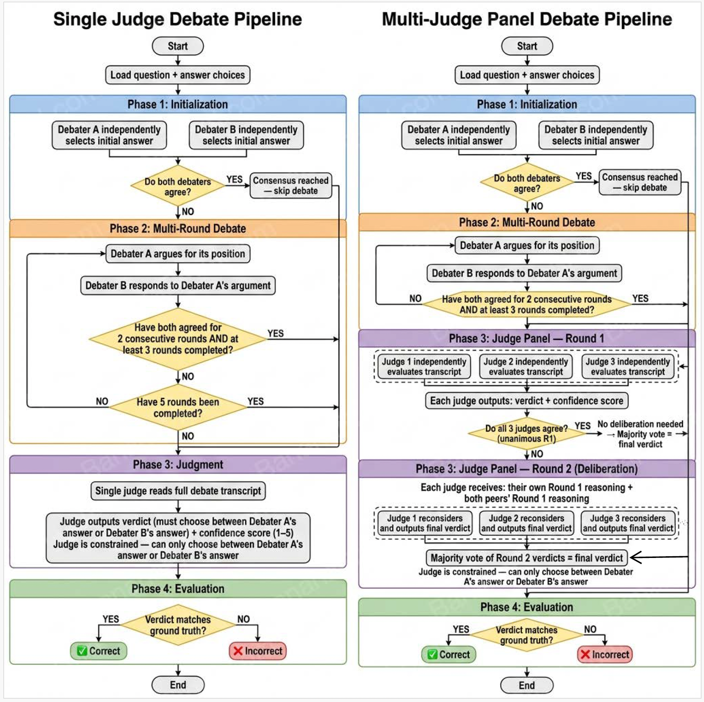

# Assignment 2: LLM Debate with Judge Pipeline

**Course**: LLM & Agentic Systems — Graduate Course
**Due**: March 16th, 2026

A multi-agent debate system where two LLM agents argue opposing sides of a question and a third LLM judge renders a verdict. Includes a bonus multi-judge panel mode with optional deliberation. Evaluated on ARC-Challenge (Commonsense QA).

---

## Setup

### 1. Clone the repository
```bash
git clone <your-repo-url>
cd Assignment2
```

### 2. Install dependencies
```bash
pip install -r requirements.txt
```

### 3. Configure API credentials
```bash
cp .env.example .env
# Edit .env and fill in your API_BASE_URL and API_KEY
```

### 4. Download the dataset
```bash
python data/download_data.py
```

---

## Pipeline Overview



## Project Structure

```
Assignment2/
├── config.yaml            # All hyperparameters
├── requirements.txt       # Python dependencies
├── .env.example           # API key template
├── src/
│   ├── agents/
│   │   ├── debater_a.py   # Proponent agent (Llama-3.1-8B)
│   │   ├── debater_b.py   # Opponent agent (Qwen3-8B)
│   │   ├── judge.py       # Single judge agent (Llama-3.1-70B)
│   │   └── judge_panel.py # Multi-judge panel with deliberation (bonus)
│   ├── debate_orchestrator.py
│   └── utils.py
├── prompts/               # Editable prompt templates
├── experiments/           # Run scripts
├── data/                  # Dataset scripts
├── logs/                  # JSON debate transcripts (gitignored)
├── results/               # Tables and figures (gitignored)
└── ui/                    # Streamlit web interface
```

---

## Running Experiments

```bash
# Run the full debate pipeline (single judge)
python experiments/run_debate.py

# Run baselines (Direct QA + Self-Consistency)
python experiments/run_baselines.py

# Generate results tables and figures
python experiments/analyze_results.py

# Bonus: Run debate with multi-judge panel (3 judges + deliberation)
python experiments/run_debate_panel.py

# Bonus: Analyze panel results and generate panel figures
python experiments/analyze_panel_results.py
```

Panel settings (number of judges, deliberation on/off) are configured in `config.yaml` under the `panel:` section.

## Running the Web UI

```bash
streamlit run ui/app.py
```

---

## Models Used

| Role | Model |
|---|---|
| Debater A (Proponent) | Llama-3.1-8B-Instruct |
| Debater B (Opponent) | Qwen3-8B |
| Judge | Llama-3.1-70B-Instruct |
| Baseline | Llama-3.1-70B-Instruct |
