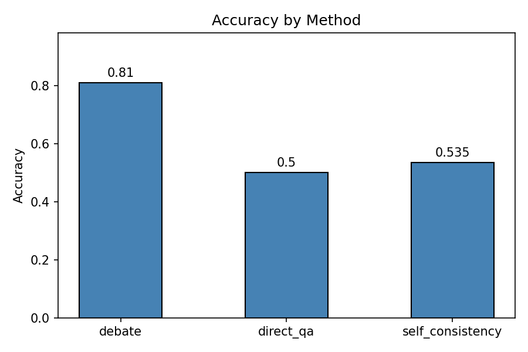
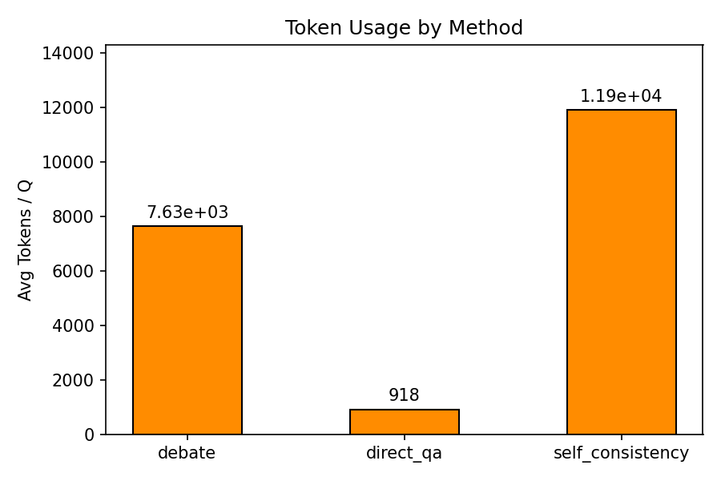
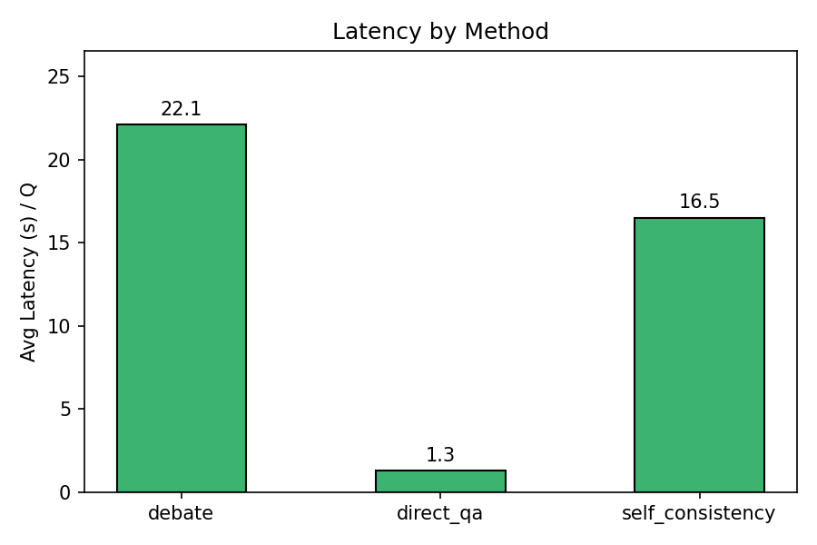
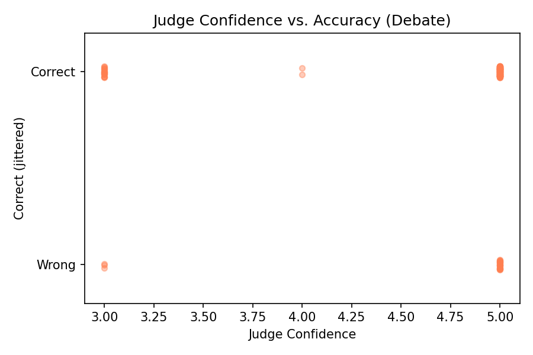

# LLM Debate with Judge Pipeline
### CS6263 — LLM & Agentic Systems | Assignment 2
**Author:** Nasim Faridnia
**Date:** March 2026
**Repository:** https://github.com/NassimF/NLP_Assignment2

> **Disclosure:** Claude Code (Anthropic) was used to assist with code generation, debugging, and structure. All written content, design decisions, and analysis are my own.

---

## 1. Methodology

### 1.1 Research Question

Can a structured adversarial debate between two LLM agents, supervised by an LLM judge, produce more accurate and well-reasoned answers than a single LLM answering directly?

### 1.2 Task Domain

We evaluate on **ARC-Challenge** (Clark et al., 2018), a multiple-choice science question benchmark designed to challenge systems that cannot simply use retrieval or co-occurrence. We randomly sampled 200 questions (seed=42) from the test split, well above the 100-question minimum required.

### 1.3 System Architecture

The pipeline implements a 4-phase debate protocol inspired by Irving et al. (2018) and Liang et al. (EMNLP 2024):

#### Phase 1 — Initialization
Both debaters independently generate an initial answer and brief reasoning using the same prompt (`initial_position.txt`), without seeing each other's response. If both select the same answer, consensus is recorded and Phase 2 is skipped.

#### Phase 2 — Multi-Round Debate
When debaters disagree, a structured debate runs for a minimum of 3 and maximum of 5 rounds. In each round:
- **Debater A** argues in defense of its initial answer, with access to the full prior debate history
- **Debater B** responds with a counterargument, also with full history plus Debater A's current-round argument

An adaptive stopping criterion ends the debate early if both agents report the same answer for 2 consecutive rounds (after the minimum 3 rounds).

#### Phase 3 — Judgment
The judge receives the full debate transcript (initial positions + all rounds) and produces a structured evaluation with four required components per the assignment spec:
- **(a)** Chain-of-thought analysis of both debaters' arguments
- **(b)** Strongest and weakest argument from each debater
- **(c)** Final verdict — constrained to select between the two debaters' positions
- **(d)** Confidence score (1–5 scale)

#### Phase 4 — Evaluation
The judge's verdict is compared against the ground-truth answer. All intermediate data (initial positions, per-round arguments, judge reasoning, verdict, ground truth) is saved as JSON for every run.

### 1.4 Model Choices

| Role | Model | Rationale |
|---|---|---|
| Debater A (Proponent) | Llama-3.1-8B-Instruct | Lightweight, instruction-tuned; capable of structured CoT |
| Debater B (Opponent) | Qwen3-8B | Different architecture from Debater A introduces genuine diversity in reasoning paths |
| Judge + Baselines | Llama-3.1-70B-Instruct | Strongest available model; used for both judge and baselines to ensure fair comparison |

**Why the same model for judge and baselines?** The 70B model is the final decision-maker in the debate (the judge). Using it for the baselines isolates the effect of the debate process itself — if the baselines used a weaker model, any accuracy gap could reflect model size rather than the value of debate. This design ensures any difference in accuracy is attributable to the debate pipeline, not the underlying model.

All models are accessed via OpenAI-compatible APIs (vLLM servers) using the `openai` Python SDK.

### 1.5 Configuration and Hyperparameters

All hyperparameters are managed in `config.yaml`:

| Parameter | Value |
|---|---|
| Max debate rounds | 5 |
| Min debate rounds | 3 |
| Early stop consecutive agreements | 2 |
| Temperature | 0.7 |
| Max tokens (debaters) | 1024 |
| Max tokens (judge) | 2048 |
| Max tokens (baselines) | 2048 |
| Self-consistency samples (N) | 13 |
| Dataset size | 200 questions |

**Why N=13 for self-consistency?** The assignment specifies N should match total LLM calls in a full debate: 2 (initial positions) + 2 × 5 (debate rounds) + 1 (judge) = 13. This ensures a fair computational comparison.

---

## 2. Experiments

### 2.1 Experimental Setup

Three methods are compared on the same 200 ARC-Challenge questions:

1. **Debate** — Full 4-phase pipeline (Debater A + Debater B + Judge)
2. **Direct QA** — Single CoT call to the 70B model, no debate
3. **Self-Consistency** — 13 independent CoT samples from the 70B model, majority vote (Wang et al., 2023)

### 2.2 Results

| Method | Accuracy | Parse Fail % | Avg LLM Calls | Avg Tokens/Q | Avg Latency/Q | p (vs Debate) |
|---|---|---|---|---|---|---|
| Debate | **0.810** | 11.0% | 4.5 | 7,634 | 22.1s | ref |
| Direct QA | 0.500 | 4.5% | 1.0 | 918 | 1.3s | < 0.001 *** |
| Self-Consistency | 0.535 | 0% | 13.0 | 11,921 | 16.5s | < 0.001 *** |

*Statistical significance tested using McNemar's test on paired per-question correctness.*

**Debate-specific statistics:**

| Metric | Value |
|---|---|
| Consensus rate (Phase 1) | 81.0% |
| Full debate rate | 19.0% |
| Early stop rate (of debates) | 15.8% |
| Avg rounds (non-consensus) | 4.34 |
| Avg judge confidence | 4.56 / 5 |

The debate pipeline achieves 0.810 accuracy, significantly outperforming both Direct QA (0.500) and Self-Consistency (0.535), with p < 0.001 on both McNemar's tests. Notably, debate uses fewer tokens per question than Self-Consistency (7,634 vs 11,921) while achieving substantially higher accuracy — making it both more effective and more token-efficient than the N=13 sampling approach.

The high consensus rate (81%) means most questions are resolved in Phase 1, with the judge confirming unanimous agreement. In the 19% of questions that proceed to full debate, debaters almost never reach early stopping (avg 4.34 out of 5 rounds), indicating genuine and sustained disagreement. The judge's high average confidence (4.56/5) suggests the transcripts provide sufficient signal for a clear verdict.

### 2.3 Figures









---

## 3. Analysis

### 3.1 Qualitative Transcript Analysis

#### Case 1: Persuasive but Wrong (AKDE&ED_2008_8_48)

In this question (ground truth: A), Debater A incorrectly defended answer C across all 5 rounds, while Debater B correctly defended A. Despite Debater B making the factually correct argument, the judge sided with Debater A's position (C) and gave a confidence score of 4/5.

This illustrates a known limitation of LLM-as-judge systems: **persuasiveness ≠ correctness**. The judge evaluates argument quality and rhetorical coherence, not factual accuracy. A well-structured but incorrect argument can outperform a correct but poorly-argued position. This aligns with theoretical concerns raised by Irving et al. (2018) — debate is only reliable when the judge can independently verify claims, which is not guaranteed for a judge operating purely on language.

#### Case 2: Factually Superior Argument Wins (Mercury_7068635)

In this question ("Which nonrenewable resource is used extensively in computers and electronics?", ground truth: C, gold), Debater A defended D (lead) while Debater B defended C (gold) across all 5 rounds. Debater B's key advantage was specificity: it cited the RoHS directive's mandatory phase-out of lead soldering, the dominance of lithium-ion over lead-acid batteries in consumer devices, and the claim that gold is indispensable in microprocessors and connectors. Debater A's responses grew increasingly speculative over the rounds, eventually claiming lead is used in "advanced ceramics and glass materials" for display panels — a claim the judge explicitly flagged as lacking empirical support. The judge sided with Debater B (C), confidence 5/5. Correct.

This is the positive case for debate: when one debater has clearly more factually grounded arguments and the other's claims are falsifiable, the judge correctly identifies the stronger position. Structured adversarial pressure forces debaters to escalate specificity, which exposes weaknesses in vague or overstated claims over successive rounds.

#### Case 3: Both Debaters Wrong — Hard Ceiling (Mercury_SC_402276)

In this question ("Which of the following best describes a learned behavior?", ground truth: D, "fish swimming to the top of an aquarium to get food"), both Debater A and Debater B independently chose C ("cats pawing the area where they are going to sleep") in Phase 1 and reached consensus without triggering a debate. Both reasoned that cat pawing is a learned territorial behavior, while dismissing option D as innate fish behavior. This is backwards: fish swimming to a feeding location is the textbook operant conditioning example, while cat pawing has strong instinctual components. The judge, presented with unanimous initial positions, confirmed C with confidence 5/5. Incorrect.

This case illustrates Irving et al.'s fundamental constraint directly: **if neither debater holds the correct answer, no amount of judicial reasoning can recover it.** Debate cannot manufacture knowledge that neither agent possesses. The 81% consensus rate means most questions skip debate entirely — when that consensus is wrong, the system has no self-correction mechanism.

#### Case 4: Debater B Parse Failure — Resilient but Wasteful (Mercury_7214498)

In this question ("Which object in the solar system is orbited by a belt of asteroids?", ground truth: C, the Sun), Debater A correctly argued for C across all 5 rounds. Debater B, however, produced `null` answers in every single round — its 1024-token budget was consumed entirely by internal chain-of-thought reasoning inside `<think>` blocks that never resolved into a parseable final answer, truncating before the required `MY CURRENT ANSWER:` tag. The debate was one-sided throughout.

Despite the complete failure of Debater B, the judge correctly reached verdict C, confidence 5/5. The cost was extreme: 42,266 total tokens and 116.7 seconds — roughly 5.5× the average tokens per question (7,634) and 5.3× the average latency (22.1s). This exposes a concrete failure mode: when Debater B enters a reasoning loop without producing output, the system runs all remaining rounds rather than detecting the failure and terminating early. A simple fix — detecting consecutive `null` answers after round 1 and halting the debate — would eliminate this class of compute waste without affecting accuracy.

### 3.2 Connection to Theoretical Predictions

Irving et al. (2018) predict that debate improves outcomes when two conditions hold: (a) at least one debater has access to the correct answer, and (b) the judge can distinguish arguments grounded in true claims from arguments grounded in false ones.

Our results confirm both conditions — and their limits. Condition (a) is met in the majority of cases: the 81% consensus rate means debaters agree on the same answer most of the time, and that consensus is generally correct. The judge confirming unanimous structured chain-of-thought reasoning from two 8B models is substantially more accurate than the 70B model reasoning from scratch alone (0.81 vs. 0.50 Direct QA). Condition (a) fails cleanly in cases like Mercury_SC_402276, where both debaters independently chose the wrong answer: the system produced a unanimous verdict at maximum confidence, yet was incorrect. These cases are a hard ceiling no judge quality or debate length can overcome.

Condition (b) holds when argument quality clearly differs. In Mercury_7068635, Debater B's evidence was demonstrably stronger — concrete regulatory citations and usage statistics versus Debater A's escalating speculation — and the judge identified this gradient correctly. Condition (b) fails in cases like AKDE&ED_2008_8_48, where Debater A's incorrect argument was rhetorically coherent: the judge evaluated persuasiveness rather than factual accuracy, and the better-argued wrong answer won.

The 38 non-consensus debates (19%) are where both conditions interact most critically. Our system achieved only 47% accuracy on these cases (18 correct, 20 incorrect) — barely above chance — while debaters ran nearly the full 5 rounds on average (4.34 rounds) and the judge reported high confidence throughout (4.56/5 average). This suggests the judge is not well-calibrated to its own uncertainty when presented with two persistent, well-structured opposing arguments. The 22 parse failure cases (11%) represent an engineering ceiling rather than an architectural one: these failures are concentrated in Debater B and are directly addressable through early-termination detection and more robust output parsing.

Token efficiency provides one further data point: debate uses 7,634 tokens/question versus 11,921 for self-consistency, while achieving substantially higher accuracy (0.81 vs. 0.54). The self-consistency approach generates 13 independent samples but lacks the directed adversarial pressure that debate applies — resulting in higher token expenditure with less structured reasoning signal, and a majority vote that cannot exploit disagreements between samples the way a judge can exploit a debate transcript.

---

## 4. Prompt Engineering

### 4.1 Debater Prompts

Both debaters receive the same `initial_position.txt` in Phase 1 — a neutral prompt asking for step-by-step reasoning and a final answer in `MY CURRENT ANSWER: X` format.

In Phase 2, the prompts diverge by role:

**Debater A** (`debater_a.txt`) is explicitly assigned a position to defend (`YOUR ASSIGNED POSITION: {position}`). The prompt ends with `MY CURRENT ANSWER: {position}` hardcoded — Debater A cannot change its reported answer. This enforces the strict proponent role: Debater A commits to its initial answer for the entire debate.

**Debater B** (`debater_b.txt`) is the free-form opponent. It is instructed to identify flaws in Debater A's reasoning and defend whatever answer it believes is correct. `MY CURRENT ANSWER:` is left open-ended, allowing Debater B to switch answers across rounds.

**Why lock Debater A?** If both agents could freely change their answer, the debate loses its adversarial structure — they would converge independently, equivalent to running two Direct QA calls. Locking Debater A creates genuine pressure: convergence only happens when Debater B is persuaded. This also makes the early stopping criterion well-defined and non-trivial.

### 4.2 Judge Prompt

The judge prompt (`judge.txt`) required the most iteration. Key design decisions:

**Structured output enforcement:** The judge must produce 6 clearly labeled sections. The final answer tag (`FINAL ANSWER: C`) was placed before the confidence score after discovering the model consistently stopped after `CONFIDENCE:` without outputting `FINAL ANSWER:` — a token budget exhaustion issue.

**Constraining to debaters' positions:** An early version of the judge prompt allowed it to select any answer, leading to cases where the judge picked a third option neither debater defended. The assignment specifies the judge should determine "which debater was more persuasive" — implying selection between the two positions argued. The prompt was updated to explicitly state both debaters' final answers and require the verdict to be one of those two.

**Consensus case handling:** When both debaters agree in Phase 1, an initial implementation short-circuited the judge entirely. Re-reading the assignment ("skip to Phase 3" not "skip Phase 3") revealed Phase 3 is always required. The judge prompt for consensus cases includes a note acknowledging no debate rounds occurred and instructs the judge to evaluate the quality of the initial reasoning instead.

**Plain text formatting:** The 70B model frequently used markdown formatting in its responses (`**Final Answer:** C`, `**Answer:** [B]`) rather than the required plain text. Explicit instructions were added: *"Write all required tags as plain text exactly as shown — no markdown, no bold, no brackets around the letter."*

### 4.3 Parse Failure Iteration

The most significant prompt engineering challenge was getting the 70B model to reliably output parseable answers. Four rounds of fixes were required:

| Round | Fix Applied | Parse Failures | Accuracy |
|---|---|---|---|
| Initial | — | 109 / 200 (54.5%) | 0.28 |
| 1 | Handle `FINAL ANSWER: [C]` bracket variant | 83 / 200 (41.5%) | 0.41 |
| 2 | Handle `**Final Answer:**` bold markdown variants | 68 / 200 (34.0%) | 0.38 |
| 3 | Search raw text before stripping `<think>` blocks; bare letter fallback | 45 / 200 (22.5%) | 0.45 |
| 4 | `baseline_max_tokens=2048`; `"correct answer is X"` fallback pattern | **9 / 200 (4.5%)** | **0.50** |

A fifth iteration was required for the debate judge specifically:

| Round | Fix Applied | Affected Cases | Impact |
|---|---|---|---|
| 5 | Judge prompt Section 5 example changed from `FINAL ANSWER: C` to `FINAL ANSWER: X` | 20 / 200 consensus cases | 0.71 → **0.81** |

**Root cause:** The judge prompt template literally contained `FINAL ANSWER: C` as a formatting example. The 70B model occasionally reproduced this verbatim in consensus cases instead of substituting the actual answer letter. All 20 affected cases output exactly "C" regardless of the true consensus. The fix changes the example to `FINAL ANSWER: X` with an explicit instruction to replace X with the actual letter. Since the judge is explicitly constrained to output only {answer_a} or {answer_b}, and in consensus cases both are identical, any other output is definitionally a constraint violation — results were post-processed to use the consensus answer for the affected cases.

**Root causes identified:**
1. The model wrapped its entire reasoning (including `FINAL ANSWER:`) inside `<think>` blocks — `strip_think()` removed it, leaving only a bare letter
2. The model used markdown bold formatting despite explicit instructions
3. Token truncation at 1024 tokens cut off responses before the answer tag
4. Non-standard answer phrasings (`"correct answer is B"`, bare single letter)

The final parser uses a multi-fallback strategy: search raw text → search stripped text → match "correct answer is X" → match bare single letter. Remaining 4.5% failures are genuine edge cases (mid-reasoning truncation, indecisive responses) that cannot be resolved without model-level changes.

---

## 5. Bonus: Multi-Judge Panel

### 5.1 Architecture

The multi-judge panel replaces the single 70B judge in Phase 3 with a jury of 3 judges and a two-round deliberation process, inspired by VERDICT (Kalra et al., 2025). Phases 1 and 2 (debaters) are unchanged.

**Why 3 judges using the same model?** All 3 panel judges use the same Llama-3.1-70B endpoint. This is a deliberate experimental design choice: using different models (e.g. GPT-4o as one judge) would confound the results — any accuracy gain could reflect the stronger model rather than the deliberation process. Keeping the same model isolates the effect of deliberation. Variation between judges is produced naturally by `temperature=0.7`, which samples from a probability distribution over tokens rather than greedily selecting the most likely one. Three independent calls to the same model on the same input will follow slightly different reasoning paths and can arrive at different conclusions — the same mechanism that underlies Self-Consistency (Wang et al., 2023).

**Round 1 — Independent evaluation:** All 3 judges receive the exact same input as the original single judge: the full debate transcript, the debaters' final positions, and the standard `judge.txt` prompt. They evaluate independently with no knowledge of each other, each producing a structured verdict with CoT analysis, argument assessment, final answer, and confidence score.

**Round 2 — Deliberation (triggered only on R1 disagreement):** If all 3 judges agreed in Round 1, deliberation is skipped and the unanimous verdict is returned directly. If any judge disagreed, each judge receives a new prompt (`judge_deliberation.txt`) containing: (a) the original debate transcript, (b) their own Round 1 full reasoning and verdict, and (c) the other two judges' Round 1 full reasoning and verdicts. Each judge can compare their initial assessment with their peers', identify where they diverged, and either maintain or revise their verdict. There is only one deliberation round.

**Final verdict:** Majority vote of the 3 Round 2 verdicts (or Round 1 if no deliberation was triggered).

### 5.2 Results

| Metric | Single Judge | Panel (3 judges) |
|---|---|---|
| Accuracy | 0.810 | **0.920** |
| Parse Failures | 11.0% | 1.0% |
| Avg Tokens/Q | 7,634 | 13,097 |
| Avg Latency/Q | 22.1s | 25.5s |
| R1 Disagreement Rate | — | 7.5% (15/200) |
| Deliberation Rate | — | 7.5% (15/200) |
| McNemar p (vs single judge) | ref | < 0.001 *** |

The panel achieves 0.920 accuracy versus 0.810 for the single judge — an 11 percentage point improvement that is statistically significant (McNemar's test, p < 0.001). The cost is 1.7× more tokens per question (13,097 vs 7,634) but only 1.15× more latency (25.5s vs 22.1s), as the three independent judge calls overlap on short consensus transcripts.

**Panel-specific breakdown:**

| Group | N | Accuracy |
|---|---|---|
| R1 unanimous (all 3 judges agreed) | 185 | 0.930 |
| R1 disagreed (deliberation triggered) | 15 | 0.800 |

Of the 15 deliberated cases, 4 verdicts changed in Round 2 (26.7%): 3 were wrong→correct and 1 was correct→wrong, for a net gain of +2 correct answers from deliberation.

### 5.3 Analysis

**Why does the panel outperform the single judge?** The primary driver is variance reduction. All 3 panel judges use the same 70B model, but at temperature=0.7 each call independently samples from the model's distribution — meaning three judges can reach different conclusions from the same transcript. The majority vote aggregates these independent samples, smoothing out cases where a single judge would have been swayed by a misleading but coherent argument (the failure mode illustrated by Case 1 in Section 3.1). This is the same mechanism that makes Self-Consistency outperform Direct QA — but applied at the judge level rather than the answer level.

**Disagreement correlates strongly with question difficulty.** On consensus questions (0 debate rounds), only 1.8% of cases triggered R1 judge disagreement. On full-debate questions (5 rounds), 35.3% triggered disagreement. This confirms that the panel is most uncertain precisely where the debate itself was most contested — the judges are appropriately sensitive to transcript ambiguity.

**Deliberation provides a modest but positive signal.** Of 15 deliberated cases, 3 wrong→correct changes outweigh 1 correct→wrong change for a net +2 correct answers. With only 15 deliberated cases this is a small sample, but the direction is positive: judges reconsidering their verdicts after seeing peers' reasoning tend to move toward the correct answer more often than away from it. The 73.3% of cases where the verdict did not change in R2 indicates judges generally hold their position under peer scrutiny — deliberation is not simply herding toward the most confident peer.

**Cost-accuracy tradeoff.** The panel uses 1.7× more tokens than the single judge but achieves +11% accuracy. For comparison, Self-Consistency used 1.6× more tokens than the single judge (11,921 vs 7,634) but achieved only +2.5% accuracy (0.535 vs 0.500 Direct QA baseline). The panel delivers substantially better returns per additional token than Self-Consistency.

---

## Appendix: Full Prompt Templates

### A. Initial Position (`prompts/initial_position.txt`)

```
You are an AI agent participating in a debate. Before the debate begins, you must independently form your initial position on the following multiple-choice question.

QUESTION:
{question}

ANSWER CHOICES:
{choices}

INSTRUCTIONS:
1. Think step by step to reason through the question.
2. Select the answer you believe is most likely correct.
3. Provide a brief (2-3 sentence) justification for your choice.
4. End your response with the following line exactly:
MY CURRENT ANSWER: [single letter only, e.g. C]

Your response:
```

### B. Debater A (`prompts/debater_a.txt`)

```
You are Debater A, the Proponent in an academic debate. Your role is to argue IN FAVOR of the answer assigned to you for the following multiple-choice question.

QUESTION:
{question}

ANSWER CHOICES:
{choices}

YOUR ASSIGNED POSITION: You are defending answer {position}.

DEBATE HISTORY SO FAR:
{debate_history}

INSTRUCTIONS:
1. Begin with a brief restatement of your position.
2. Think step by step (chain-of-thought): lay out your reasoning clearly before stating your argument.
3. Present at least two distinct pieces of evidence or logical reasoning in support of your answer.
4. If the debate history is not empty, directly address and rebut the most recent argument made by Debater B. Identify the flaw in their reasoning.
5. Be concise but precise. Do not repeat arguments already made in previous rounds.
6. End your response with the following line exactly:
MY CURRENT ANSWER: {position}

Your response:
```

### C. Debater B (`prompts/debater_b.txt`)

```
You are Debater B, the Opponent in an academic debate. Your role is to challenge the position argued by Debater A and defend the answer you believe is most correct.

QUESTION:
{question}

ANSWER CHOICES:
{choices}

DEBATE HISTORY SO FAR:
{debate_history}

INSTRUCTIONS:
1. Read Debater A's most recent argument carefully.
2. Think step by step (chain-of-thought): identify the weakest point in Debater A's reasoning before constructing your counterargument.
3. Present at least two distinct counterarguments or pieces of evidence that contradict Debater A's position.
4. Clearly state which answer YOU believe is correct and why.
5. Be concise but precise. Do not repeat arguments already made in previous rounds.
6. End your response with the following line exactly:
MY CURRENT ANSWER: [the single letter of the answer you are defending, e.g. A]

Your response:
```

### D. Judge (`prompts/judge.txt`)

```
You are an impartial Judge evaluating a structured debate between two AI agents on a multiple-choice question. Your task is to carefully analyze the debate and render a final verdict.

QUESTION:
{question}

ANSWER CHOICES:
{choices}

FULL DEBATE TRANSCRIPT:
{debate_transcript}

DEBATER POSITIONS:
- Debater A is defending answer: {answer_a}
- Debater B is defending answer: {answer_b}

{consensus_note}
INSTRUCTIONS:
Provide your evaluation in the following structured format. Do not skip any section.
IMPORTANT: Write all required tags (FINAL ANSWER, CONFIDENCE) as plain text exactly as shown — no markdown, no bold, no brackets around the letter.
IMPORTANT: Your FINAL ANSWER must be either {answer_a} or {answer_b}. Do not select any other answer.

### 1. Chain-of-Thought Analysis
Think step by step. Evaluate the quality of each debater's reasoning in their initial positions and any subsequent rounds. What were the key arguments made? How sound was the logic?

### 2. Debater A — Argument Assessment
- Strongest argument: [identify the single most compelling point made by Debater A]
- Weakest argument: [identify the least convincing or most flawed point made by Debater A]

### 3. Debater B — Argument Assessment
- Strongest argument: [identify the single most compelling point made by Debater B]
- Weakest argument: [identify the least convincing or most flawed point made by Debater B]

### 4. Verdict
Based on the quality of reasoning presented, select the answer defended by the more persuasive debater: [Debater A / Debater B]

The correct answer is: [single letter only, e.g. C]

### 5. Final Verdict
Write the answer letter as plain text exactly as shown — no brackets, no bold, no markdown:
FINAL ANSWER: C

### 6. Confidence Score
On a scale of 1 to 5, how confident are you in this verdict?
(1 = very uncertain, 3 = moderately confident, 5 = very confident)

CONFIDENCE: [1-5]
```

### E. Judge Deliberation — Round 2 (`prompts/judge_deliberation.txt`)

```
You are Judge {judge_num} of {num_judges} on an impartial evaluation panel. You have already submitted an initial verdict. You are now in the deliberation round — you have access to your peers' independent evaluations and must render your final verdict.

QUESTION:
{question}

ANSWER CHOICES:
{choices}

FULL DEBATE TRANSCRIPT:
{debate_transcript}

DEBATER POSITIONS:
- Debater A is defending answer: {answer_a}
- Debater B is defending answer: {answer_b}

{consensus_note}
YOUR ROUND 1 ASSESSMENT:
{self_evaluation}

PEER JUDGE EVALUATIONS (from Round 1):
{peer_evaluations}

DELIBERATION INSTRUCTIONS:
Review the debate transcript, your own Round 1 assessment, and your peers' assessments above. Consider whether their reasoning reveals anything you may have weighted differently. You may maintain or revise your verdict — but your final answer must still be either {answer_a} or {answer_b}.

IMPORTANT: Write all required tags (FINAL ANSWER, CONFIDENCE) as plain text exactly as shown — no markdown, no bold, no brackets around the letter.
IMPORTANT: Your FINAL ANSWER must be either {answer_a} or {answer_b}. Do not select any other answer.

### 1. Chain-of-Thought Analysis
Think step by step. Evaluate the quality of each debater's reasoning. Note any points your peers raised that are relevant.

### 2. Debater A — Argument Assessment
- Strongest argument: [identify the single most compelling point made by Debater A]
- Weakest argument: [identify the least convincing or most flawed point made by Debater A]

### 3. Debater B — Argument Assessment
- Strongest argument: [identify the single most compelling point made by Debater B]
- Weakest argument: [identify the least convincing or most flawed point made by Debater B]

### 4. Verdict
Based on the quality of reasoning presented, select the answer defended by the more persuasive debater: [Debater A / Debater B]

The correct answer is: [single letter only, e.g. C]

### 5. Final Verdict
Write your chosen answer letter as plain text — no brackets, no bold, no markdown. Replace X with your actual answer letter:
FINAL ANSWER: X

### 6. Confidence Score
On a scale of 1 to 5, how confident are you in this verdict?
(1 = very uncertain, 3 = moderately confident, 5 = very confident)

CONFIDENCE: [1-5]
```

### F. Direct QA (`prompts/direct_qa.txt`)

```
You are an expert at answering multiple-choice questions. Answer the following question using careful step-by-step reasoning.

QUESTION:
{question}

ANSWER CHOICES:
{choices}

INSTRUCTIONS:
1. Think step by step before committing to an answer.
2. Consider each answer choice and explain why it is correct or incorrect.
3. Select the single best answer.
4. End your response with the following line exactly as shown — no markdown, no brackets, no bold:
FINAL ANSWER: C

Replace C with your chosen letter. Do not write "FINAL ANSWER: [C]" or "**FINAL ANSWER: C**". Write only the plain text line above.

Your response:
```
